# REF: Flow & Diagram Patterns สำหรับแต่ละ Segment — AdaPos+

## 1. RETAIL — Sale Flow

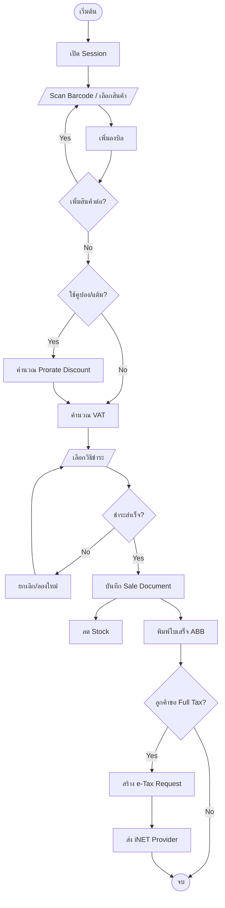

---

## 2. RETAIL — Return/CN Flow

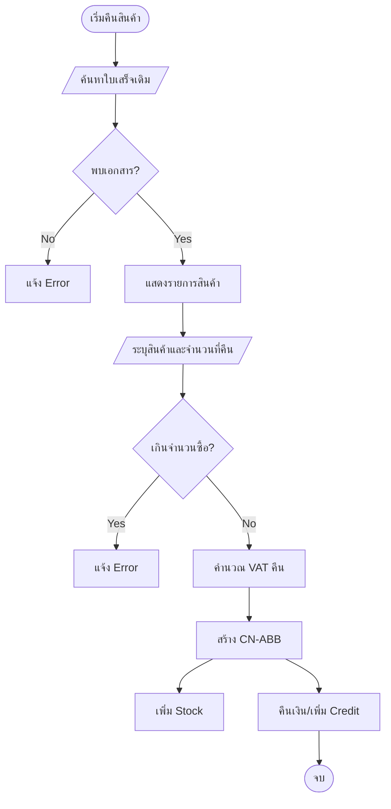

---

## 3. PROCUREMENT — Purchase Order Flow

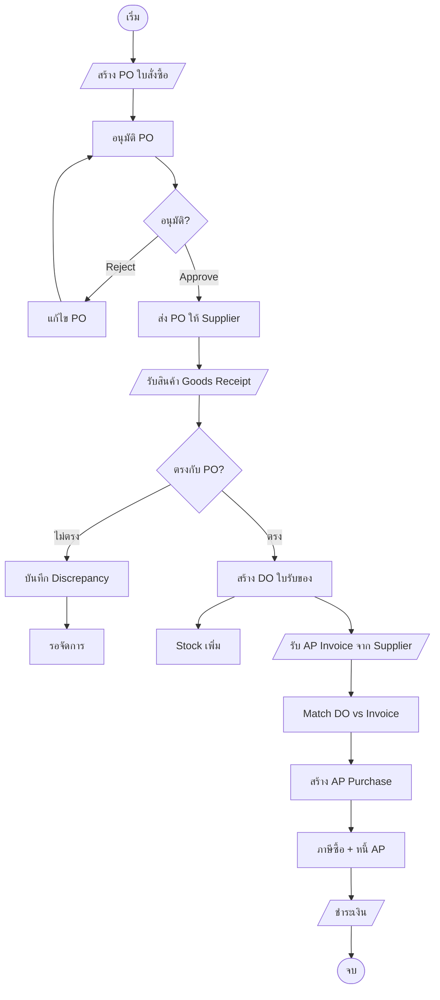

---

## 4. FOOD COURT — Store Debit Flow

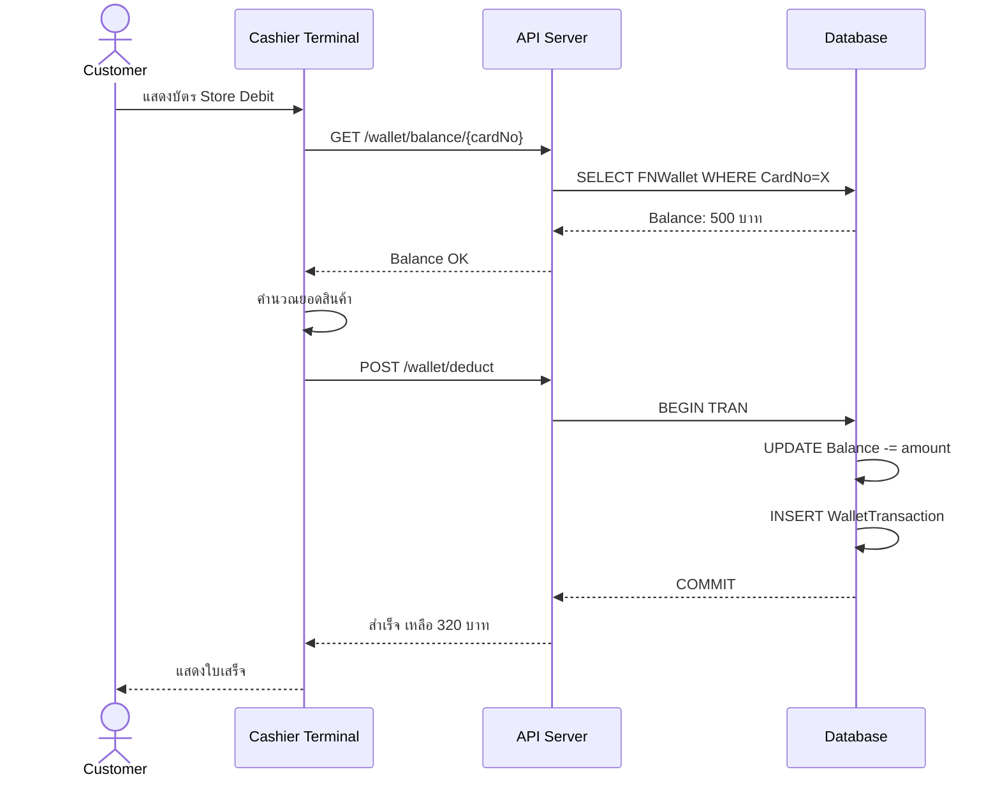

---

## 5. DUTY FREE — Sale Flow

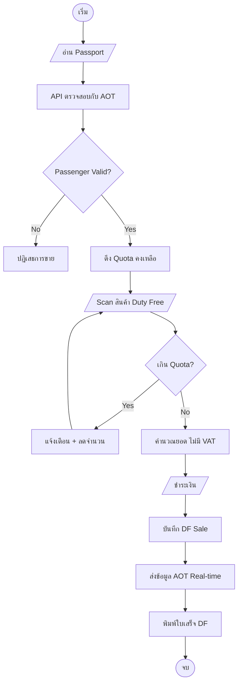

---

## 6. e-TAX — Full Tax Request Flow

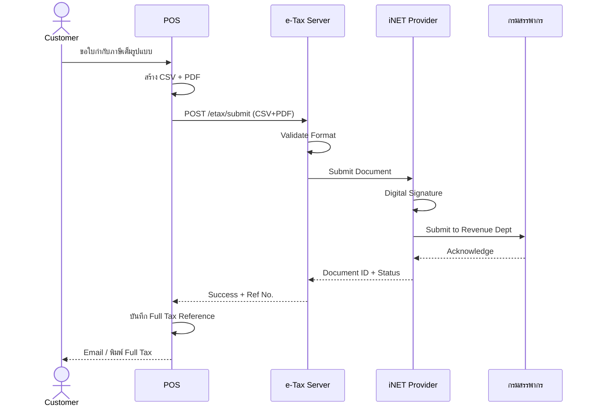

---

## 7. CONSIGNMENT (PAS) — Flow

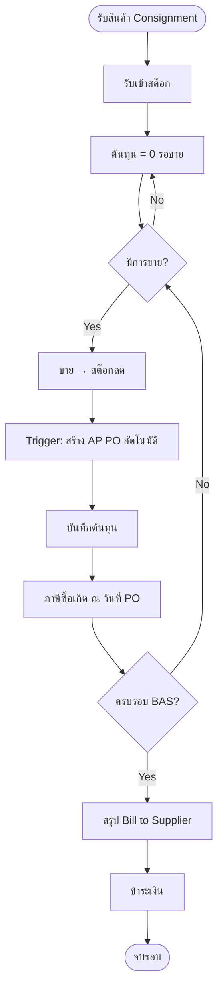

---

## 8. STOCK COUNT (HHT) — Flow

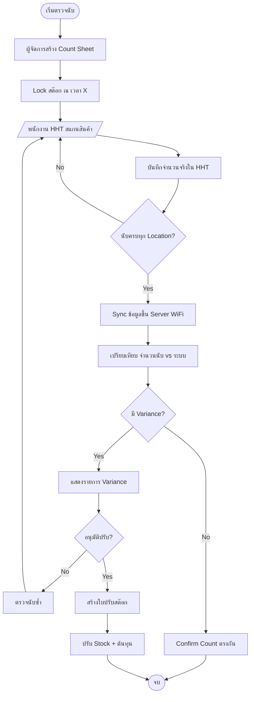

---

## 9. FASHION — Size Matrix Flow

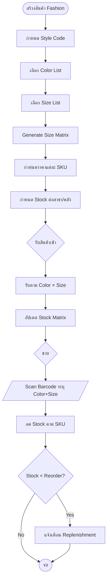

---

## 10. MEMBER LOYALTY — Points Flow

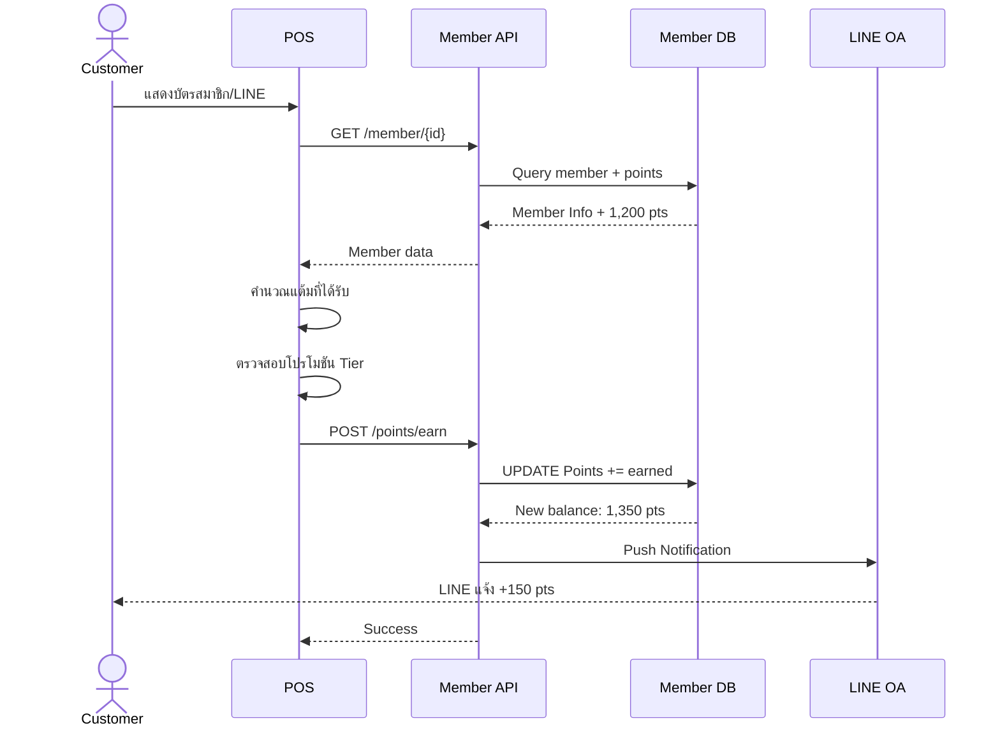

---

## 11. ERP INTEGRATION — Interface Flow

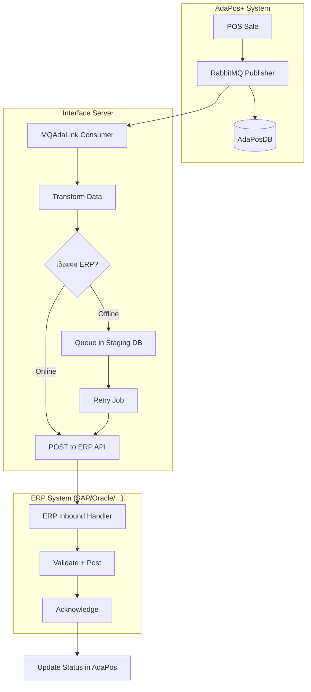

---

## 12. DEPOSIT (มัดจำ) — Prorate VAT Flow

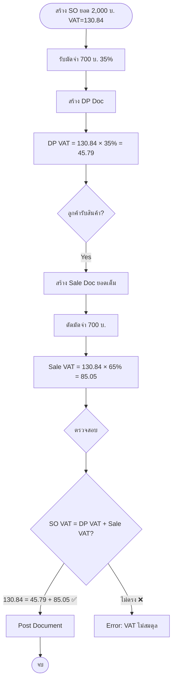
